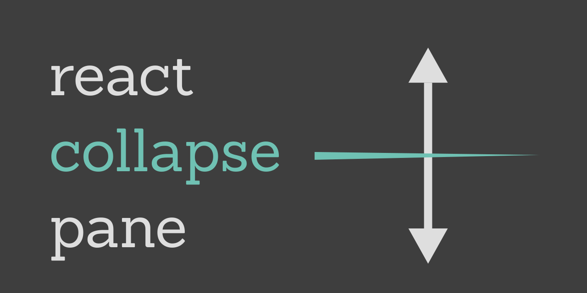

# react-collapse-pane

This is intended to be **the** simple, reliable, configurable, and elegant solution to having splittable, draggable and collapsible panes in your React application. 

<a href="https://collapse-pane.zurg.dev" target="_blank"></a>
<p align="center">
  <a href="https://github.com/b-zurg/react-collapse-pane/pulls">
    
  </a>
  
  <a href="#contributors">
    
  </a>
  <a href="https://github.com/prettier/prettier">
    
  </a>
  <a href="https://github.com/semantic-release/semantic-release">
    
  </a>
  <a href="https://www.npmjs.com/package/react-collapse-pane/v/latest">
    
  </a>
  <a href="https://www.npmjs.com/package/react-collapse-pane/v/next">
    
  </a>
  <a href="https://www.npmjs.com/package/react-collapse-pane/v/latest">
    
  </a>
  <a href="https://react-collapse-pane.zurg.dev/?path=/story/*">
    
  </a>
  <a href="https://opensource.org/licenses/MIT">
    
  </a>

</p>

## [[click for storybook demo]](https://storybook.collapse-pane.zurg.dev/)
## [[click for documentation site]](https://collapse-pane.zurg.dev/)

# Getting Started :rocket:

Install react-collapse-pane:
```bash
npm i react-collapse-pane

# or for yarn

yarn add react-collapse-pane
```

Once installed you can import the `SplitPane` component in your code.

```ts
import { SplitPane } from "react-collapse-pane";
```

If you're using Typescript the `SplitPaneProps`, as well as a few other helper types type is also available.
```ts
import { SplitPane, SplitPaneProps, ResizerOptions, CollapseOptions, SplitPaneHooks } from "react-collapse-pane";
```
# Quick Start Usage :fire:

The only component you must interact with is `SplitPane`.  This serves as a wrapper for all of the children you wish to lay out.

All you're required to give is a `split` prop which can be either `"horizontal"` or `"vertical"`.  This identifies what the orientation of the split panel will be.

```tsx
<SplitPane split="vertical">
  <div>This is the first div</div>
  <div>This is the second div</div>
  <div>This is the third div</div>
  This is the fourth but not a div!
</SplitPane>
```

What you just did is make a splittable panel layout!

## Congrats!  That was easy! :grin:

This basically splits the children vertically (i.e. full-height split).  The children can be any valid React child.  If a child is `null` it will be excluded from being split or displayed.

By default there is a 1px divider with a grabbable surface of 1rem width or height (depending on the split). 


There is also no limit to the number of divs you have as children.  The `SplitPane` will split them all accordingly.

## But what about *collapsing* the panels, *styling* the resizer, or *RTL* support? :sob:

This library supports all of these things and more! 

For more details check out [the documentation](https://collapse-pane.zurg.dev/)

# Documentation

Documentation can be found at https://collapse-pane.zurg.dev 

If you notice an issue then please make an issue or a PR!  All docs are generated from the `docs` folder in the master branch.

# Contributing and PRs :sparkling_heart:

If you would like to contribute please check out the [contributor guide](/CONTRIBUTING.md)

All contributions are welcome! All issues and feature requests are welcome!

# Credit and Attribution :pray:

This project did not start off from scratch.  The foundation of the project was the excellently written [react-multi-split-pane](https://github.com/neoraider/react-multi-split-pane) library which is itself a typescript rewrite of the [react-split-pane](https://github.com/tomkp/react-split-pane) library.  

Much gratitude to their authors, [@NeoRaider](https://github.com/NeoRaider) and [@tomkp](https://github.com/tomkp) 

## Contributors ✨

Thanks goes to these wonderful people ([emoji key](https://allcontributors.org/docs/en/emoji-key)):

<!-- ALL-CONTRIBUTORS-LIST:START - Do not remove or modify this section -->
<!-- prettier-ignore-start -->
<!-- markdownlint-disable -->
<table>
  <tr>
    <td align="center"><a href="https://github.com/b-zurg"><br /><sub><b>Buzurg Arjmandi</b></sub></a><br /><a href="https://github.com/b-zurg/react-collapse-pane/commits?author=b-zurg" title="Tests">⚠️</a> <a href="https://github.com/b-zurg/react-collapse-pane/commits?author=b-zurg" title="Documentation">📖</a> <a href="https://github.com/b-zurg/react-collapse-pane/commits?author=b-zurg" title="Code">💻</a> <a href="#design-b-zurg" title="Design">🎨</a> <a href="#example-b-zurg" title="Examples">💡</a> <a href="#platform-b-zurg" title="Packaging/porting to new platform">📦</a></td>
    <td align="center"><a href="https://github.com/hst44"><br /><sub><b>hst44</b></sub></a><br /><a href="https://github.com/b-zurg/react-collapse-pane/issues?q=author%3Ahst44" title="Bug reports">🐛</a></td>
  </tr>
</table>

<!-- markdownlint-enable -->
<!-- prettier-ignore-end -->
<!-- ALL-CONTRIBUTORS-LIST:END -->

This project follows the [all-contributors](https://github.com/all-contributors/all-contributors) specification. Contributions of any kind welcome!
